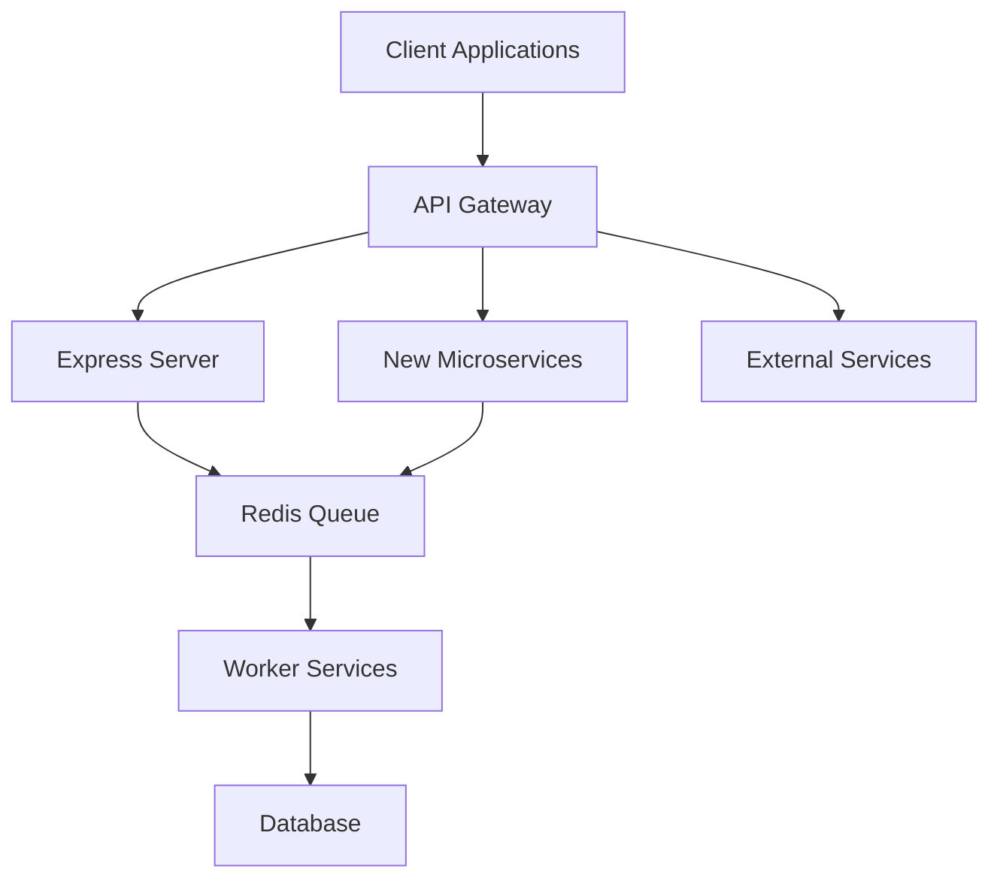

# API Gateway Design for Movie Booking App

## Introduction

This document outlines the design for a new API Gateway component to improve the Movie Booking App's API architecture. The API Gateway will serve as a unified entry point for all client applications, providing enhanced security, better traffic management, and improved monitoring capabilities.

## Architecture Overview

The API Gateway will sit between client applications (web, mobile) and the backend services, handling cross-cutting concerns like authentication, rate limiting, and request routing.



## Key Components

### 1. API Gateway Service

A new service that will handle all incoming API requests, implementing:

- **Request Routing**: Direct requests to appropriate backend services
- **Authentication & Authorization**: Centralized auth handling
- **Rate Limiting**: Prevent abuse and ensure fair resource allocation
- **Request Validation**: Validate request parameters before forwarding
- **Response Transformation**: Format responses consistently
- **Logging & Monitoring**: Comprehensive request tracking
- **Caching**: Cache common responses to reduce backend load

### 2. API Contracts

Standardized API contracts for all services with:

- OpenAPI (Swagger) specifications
- Consistent error response formats
- Versioning strategy
- Documentation generation

## Implementation Details

### Technology Stack

- **Gateway Framework**: Express.js with API gateway middleware
- **Authentication**: JWT-based with refresh token support
- **Documentation**: OpenAPI 3.0 with Swagger UI
- **Monitoring**: Prometheus metrics endpoint for request/response statistics

### Core Gateway Services

#### Authentication Service

```typescript
// api-gateway/src/services/auth.service.ts
import { Request, Response, NextFunction } from 'express';
import jwt from 'jsonwebtoken';

export class AuthService {
  public validateToken(req: Request, res: Response, next: NextFunction) {
    const token = req.headers.authorization?.split(' ')[1];
    
    if (!token) {
      return res.status(401).json({ message: 'Authentication token required' });
    }
    
    try {
      const decoded = jwt.verify(token, process.env.JWT_SECRET as string);
      req.user = decoded;
      next();
    } catch (error) {
      return res.status(401).json({ message: 'Invalid or expired token' });
    }
  }
  
  public requireRole(roles: string[]) {
    return (req: Request, res: Response, next: NextFunction) => {
      if (!req.user) {
        return res.status(401).json({ message: 'Authentication required' });
      }
      
      if (!roles.includes(req.user.role)) {
        return res.status(403).json({ message: 'Insufficient permissions' });
      }
      
      next();
    };
  }
}
```

#### Rate Limiting Service

```typescript
// api-gateway/src/services/rate-limit.service.ts
import { Request, Response, NextFunction } from 'express';
import { createClient } from 'redis';

export class RateLimitService {
  private readonly redisClient = createClient({ url: process.env.REDIS_URL });
  private readonly windowSizeInSeconds: number = 60;
  
  constructor() {
    this.redisClient.connect().catch(console.error);
  }
  
  public createLimiter(maxRequests: number) {
    return async (req: Request, res: Response, next: NextFunction) => {
      const identifier = req.ip || req.headers['x-forwarded-for'] || 'unknown';
      const key = `rate-limit:${identifier}`;
      
      try {
        // Get current count
        const currentCount = await this.redisClient.get(key) || '0';
        const count = parseInt(currentCount, 10);
        
        if (count >= maxRequests) {
          return res.status(429).json({ 
            message: 'Too many requests, please try again later.',
            retryAfter: this.windowSizeInSeconds
          });
        }
        
        // First request in this window
        if (count === 0) {
          await this.redisClient.set(key, '1', { EX: this.windowSizeInSeconds });
        } else {
          await this.redisClient.incr(key);
        }
        
        // Add headers
        res.setHeader('X-RateLimit-Limit', maxRequests.toString());
        res.setHeader('X-RateLimit-Remaining', (maxRequests - count - 1).toString());
        
        next();
      } catch (error) {
        console.error('Rate limiter error:', error);
        // On error, allow the request to proceed
        next();
      }
    };
  }
}
```

#### Request Routing Service

```typescript
// api-gateway/src/services/router.service.ts
import { Router } from 'express';
import { createProxyMiddleware } from 'http-proxy-middleware';
import { AuthService } from './auth.service';
import { RateLimitService } from './rate-limit.service';

export class RouterService {
  private router = Router();
  private authService = new AuthService();
  private rateLimitService = new RateLimitService();
  
  constructor() {
    this.setupRoutes();
  }
  
  private setupRoutes() {
    // Public routes
    this.router.use('/api/v1/movies', 
      this.rateLimitService.createLimiter(100),
      createProxyMiddleware({ 
        target: process.env.MOVIE_SERVICE_URL, 
        changeOrigin: true,
        pathRewrite: { '^/api/v1/movies': '/movies' },
      })
    );
    
    // Authentication required routes
    this.router.use('/api/v1/bookings', 
      this.authService.validateToken,
      this.rateLimitService.createLimiter(30),
      createProxyMiddleware({ 
        target: process.env.BOOKING_SERVICE_URL, 
        changeOrigin: true,
        pathRewrite: { '^/api/v1/bookings': '/' },
        onProxyReq: (proxyReq, req) => {
          // Add user ID from JWT to the proxied request
          proxyReq.setHeader('X-User-Id', req.user.id);
        }
      })
    );
    
    // Admin routes
    this.router.use('/api/v1/admin', 
      this.authService.validateToken,
      this.authService.requireRole(['admin']),
      this.rateLimitService.createLimiter(50),
      createProxyMiddleware({ 
        target: process.env.ADMIN_SERVICE_URL, 
        changeOrigin: true,
        pathRewrite: { '^/api/v1/admin': '/' }
      })
    );
  }
  
  public getRouter(): Router {
    return this.router;
  }
}
```

#### Logging & Monitoring Service

```typescript
// api-gateway/src/services/monitoring.service.ts
import { Request, Response, NextFunction } from 'express';
import { register } from 'prom-client';

export class MonitoringService {
  private requestDurationHistogram: any;
  private requestCounter: any;
  
  constructor() {
    // Initialize Prometheus metrics
    const { Histogram, Counter } = require('prom-client');
    
    this.requestDurationHistogram = new Histogram({
      name: 'http_request_duration_seconds',
      help: 'HTTP request duration in seconds',
      labelNames: ['method', 'route', 'status_code'],
      buckets: [0.05, 0.1, 0.2, 0.5, 1, 2, 5, 10]
    });
    
    this.requestCounter = new Counter({
      name: 'http_requests_total',
      help: 'Total number of HTTP requests',
      labelNames: ['method', 'route', 'status_code']
    });
  }
  
  public requestLogger() {
    return (req: Request, res: Response, next: NextFunction) => {
      const startTime = Date.now();
      
      // Once the request is finished
      res.on('finish', () => {
        const duration = (Date.now() - startTime) / 1000;
        const route = req.path;
        const method = req.method;
        const statusCode = res.statusCode.toString();
        
        // Record metrics
        this.requestDurationHistogram.observe(
          { method, route, status_code: statusCode }, 
          duration
        );
        
        this.requestCounter.inc({ 
          method, 
          route, 
          status_code: statusCode 
        });
        
        // Log request details
        console.log(
          `[${new Date().toISOString()}] ${method} ${route} ${statusCode} ${duration.toFixed(3)}s`
        );
      });
      
      next();
    };
  }
  
  public metricsEndpoint() {
    return async (_req: Request, res: Response) => {
      res.setHeader('Content-Type', register.contentType);
      res.end(await register.metrics());
    };
  }
}
```

### Main Gateway Application

```typescript
// api-gateway/src/index.ts
import express from 'express';
import helmet from 'helmet';
import cors from 'cors';
import { RouterService } from './services/router.service';
import { MonitoringService } from './services/monitoring.service';

async function bootstrap() {
  const app = express();
  const port = process.env.PORT || 3000;
  
  // Core middleware
  app.use(helmet());
  app.use(cors());
  app.use(express.json());
  
  // Monitoring
  const monitoringService = new MonitoringService();
  app.use(monitoringService.requestLogger());
  app.get('/metrics', monitoringService.metricsEndpoint());
  
  // API routes
  const routerService = new RouterService();
  app.use(routerService.getRouter());
  
  // Error handler
  app.use((err, req, res, next) => {
    console.error(err.stack);
    res.status(500).json({
      message: 'An unexpected error occurred',
      error: process.env.NODE_ENV === 'production' ? undefined : err.message
    });
  });
  
  app.listen(port, () => {
    console.log(`API Gateway running on port ${port}`);
  });
}

bootstrap().catch(console.error);
```

## API Versioning Strategy

The API Gateway will implement the following versioning strategy:

1. **URI Path Versioning**: All endpoints will include version in the path (`/api/v1/resource`)
2. **Version Transitions**:
   - Major version changes (e.g., v1 to v2) for breaking changes
   - Support for at least one previous major version with deprecation notices
   - Minor version changes handled transparently without URI changes

Example versioning headers:
```
X-API-Version: 1.2.0
X-API-Deprecated: false
X-API-Sunset-Date: null
```

## Security Enhancements

The API Gateway will implement several security features:

1. **JWT Authentication**: Token-based auth with short-lived access tokens and refresh tokens
2. **Rate Limiting**: Per-IP and per-user rate limits to prevent abuse
3. **Input Validation**: Schema-based validation of all incoming requests
4. **CORS Configuration**: Proper cross-origin resource sharing settings
5. **Security Headers**: Helmet middleware to add security headers
6. **TLS Termination**: HTTPS enforcement and TLS certificate management

## Deployment Considerations

The API Gateway should be deployed as a highly available service:

1. **Container-Based Deployment**: Docker container for the API Gateway
2. **Load Balancing**: Multiple instances behind a load balancer
3. **Auto-Scaling**: Scale based on CPU/memory usage or request rate
4. **Health Checks**: Implement `/health` endpoint for monitoring
5. **Circuit Breaking**: Implement circuit breakers for downstream service calls

## Monitoring and Observability

The API Gateway will expose metrics and logs for comprehensive monitoring:

1. **Prometheus Metrics**: Request rates, response times, error rates
2. **Distributed Tracing**: Request IDs and tracing headers
3. **Structured Logging**: JSON-formatted logs with request context
4. **Alerts**: Define alert thresholds for error rates and response times

## Implementation Plan

1. **Phase 1** (2 weeks):
   - Develop core API Gateway functionality
   - Implement authentication and basic routing

2. **Phase 2** (2 weeks):
   - Add rate limiting and request validation
   - Implement comprehensive monitoring

3. **Phase 3** (1 week):
   - Migration strategy for existing endpoints
   - Documentation and developer guides

4. **Phase 4** (1 week):
   - Testing and performance tuning
   - Production deployment

## API Documentation

All APIs exposed through the gateway will be documented using OpenAPI 3.0 specifications. A Swagger UI instance will be available at `/api/docs` for interactive documentation.

Example OpenAPI schema for the Movies API:

```yaml
openapi: 3.0.0
info:
  title: Movie Booking API
  version: 1.0.0
  description: API for the Movie Booking application
paths:
  /api/v1/movies:
    get:
      summary: List all movies
      parameters:
        - name: city
          in: query
          schema:
            type: string
        - name: date
          in: query
          schema:
            type: string
            format: date
      responses:
        '200':
          description: A list of movies
          content:
            application/json:
              schema:
                type: array
                items:
                  $ref: '#/components/schemas/Movie'
components:
  schemas:
    Movie:
      type: object
      properties:
        id:
          type: integer
        name:
          type: string
        languages:
          type: array
          items:
            type: string
        certificate:
          type: string
        rating:
          type: string
        poster:
          type: string
```

## Conclusion

The API Gateway will significantly enhance the Movie Booking App's architecture by providing a unified entry point with improved security, monitoring, and developer experience. It will enable the system to evolve toward a more scalable microservices architecture while maintaining backward compatibility and consistent API design.