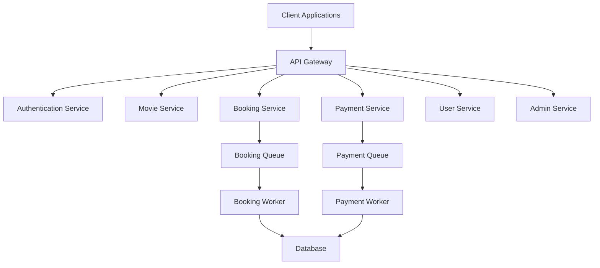
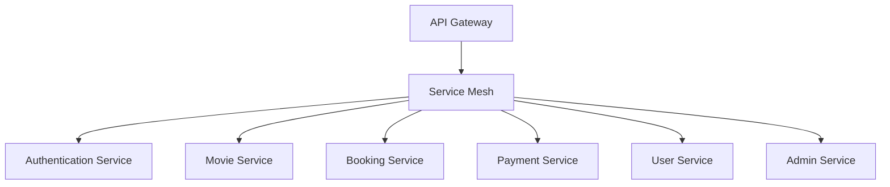
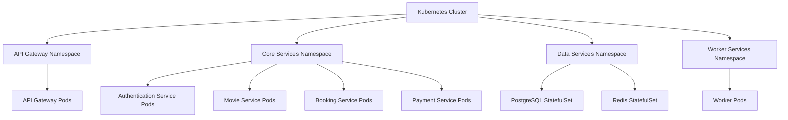

# Microservices Architecture for Movie Booking App

## Introduction

This document outlines a comprehensive microservices architecture for the Movie Booking App, evolving it from its current monolithic structure to a more scalable, resilient, and maintainable system. This architecture provides clear service boundaries, independent scaling, and improved development velocity.

## Architecture Overview

The proposed microservices architecture decomposes the current application into specialized services with clear responsibilities:

## Core Services

### API Gateway

The API Gateway serves as the entry point for all client requests, providing:

- Request routing to appropriate microservices
- Authentication and authorization
- Rate limiting and throttling
- Request/response transformation
- API documentation
- Monitoring and logging

The gateway is implemented as a lightweight Express.js application that proxies requests to the appropriate backend services based on the request path.

### Authentication Service

Responsible for user identity management and access control:

- User registration and login
- Token generation and validation (JWT)
- Role-based access control
- Password reset functionality
- Social login integration

### Movie Service

Handles all movie-related operations:

- Movie information management
- Cinema and auditorium management
- Available show times and slots
- Movie search and filtering

### Booking Service

Manages the seat booking process:

- Seat availability checking
- Temporary seat reservation
- Booking confirmation
- Booking history and management

### Payment Service

Handles payment processing:

- Payment gateway integration
- Transaction processing and recording
- Refund management
- Payment history

### User Service

Manages user profiles and preferences:

- User profile management
- User preferences
- Booking history
- Notification preferences

### Admin Service

Provides administrative capabilities:

- Content management (movies, theaters, showtimes)
- User management
- Reporting and analytics
- System configuration

## Data Management

### Database Strategy

The architecture employs a hybrid data management approach:

1. **Service-Specific Databases**:
   - Each service owns its data and schema
   - Database technology chosen based on service requirements
   - Services cannot directly access another service's database

2. **Data Consistency**:
   - Event-driven architecture for eventual consistency
   - Saga pattern for distributed transactions
   - Optimistic concurrency for high-contention operations

### Example Database Structure

**User Service DB**:
- Users (profiles, preferences, authentication)
- Notifications
- User-specific settings

**Movie Service DB**:
- Movies
- Cinemas
- Auditoriums
- Show times

**Booking Service DB**:
- Bookings
- Seats
- Seat locks
- Booking history

**Payment Service DB**:
- Transactions
- Payment methods
- Refunds

## Communication Patterns

### Synchronous Communication

- REST APIs for direct service-to-service communication
- GraphQL for complex data requirements
- Circuit breakers for fault tolerance

### Asynchronous Communication

- Redis queues for high-throughput operations
- Event-driven communication for eventual consistency
- Message schemas for contract enforcement

## Service Mesh Architecture

The microservices are deployed in a service mesh that provides:

Key service mesh capabilities:
- Service discovery
- Load balancing
- Traffic routing
- Failure recovery
- Security
- Observability

## Security Architecture

The architecture implements defense in depth:

1. **API Gateway Security**:
   - TLS termination
   - API keys for external systems
   - Rate limiting
   - Input validation

2. **Service-to-Service Security**:
   - Mutual TLS (mTLS)
   - Service accounts
   - Network policies

3. **Data Security**:
   - Encryption at rest
   - Encryption in transit
   - Data access controls

4. **Authentication & Authorization**:
   - JWT-based authentication
   - Role-based access control
   - Fine-grained permissions

## Deployment Architecture

The microservices are designed to be deployed in containers using Kubernetes:

### CI/CD Pipeline

Each service has its own CI/CD pipeline that includes:

1. Code linting and testing
2. Security scanning
3. Container image building
4. Vulnerability scanning
5. Deployment to staging
6. Integration testing
7. Deployment to production

## Domain-Driven Design

The microservices architecture follows Domain-Driven Design principles:

### Bounded Contexts

- **User Domain**: User profiles, preferences, authentication
- **Movie Domain**: Movies, cinemas, schedules
- **Booking Domain**: Seat selection, booking process
- **Payment Domain**: Transactions, payment methods

### Aggregates

**Booking Domain Example**:
- `Booking` (aggregate root)
  - `Seats` (entities)
  - `ShowTime` (value object)
  - `PaymentStatus` (value object)

### Domain Events

- `BookingCreated`
- `PaymentProcessed`
- `BookingConfirmed`
- `BookingCancelled`

## Observability

The architecture includes comprehensive observability:

1. **Distributed Tracing**:
   - Request IDs propagated across services
   - Trace context maintained through async operations
   - Visual tracing UI for debugging

2. **Metrics**:
   - Service-level metrics (latency, throughput, error rate)
   - Business metrics (bookings, revenue, user activity)
   - Infrastructure metrics (CPU, memory, network)

3. **Logging**:
   - Structured logs with consistent format
   - Centralized log aggregation
   - Log correlation with traces

4. **Alerting**:
   - Service health alerts
   - Business KPI alerts
   - Anomaly detection

## Implementation Roadmap

### Phase 1: Foundational Components (1-2 months)
- Implement API Gateway
- Extract Authentication Service
- Set up observability infrastructure

### Phase 2: Core Business Services (2-3 months)
- Extract Movie Service
- Extract Booking Service
- Implement service-to-service communication

### Phase 3: Advanced Features (2-3 months)
- Extract Payment Service
- Implement User Service
- Set up Admin Service

### Phase 4: Optimization (1-2 months)
- Performance tuning
- Security hardening
- Deployment automation

## Conclusion

This microservices architecture for the Movie Booking App provides a robust foundation for scaling the application to handle increased traffic, support rapid feature development, and maintain high reliability. By decomposing the application into domain-focused services with clear boundaries, the architecture enables independent scaling, deployment, and technology choices for each component while maintaining system cohesion through well-defined interfaces and communication patterns.