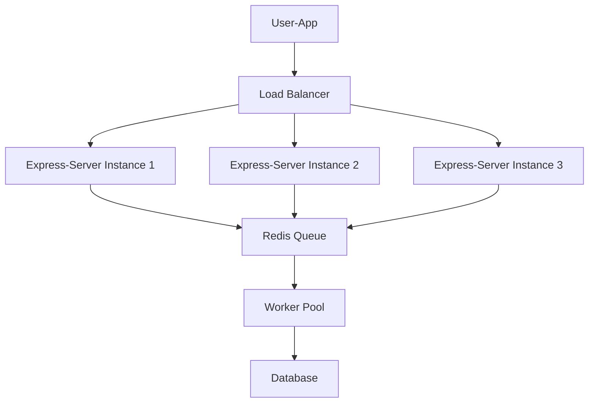
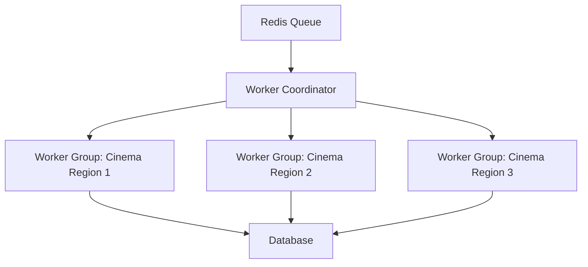
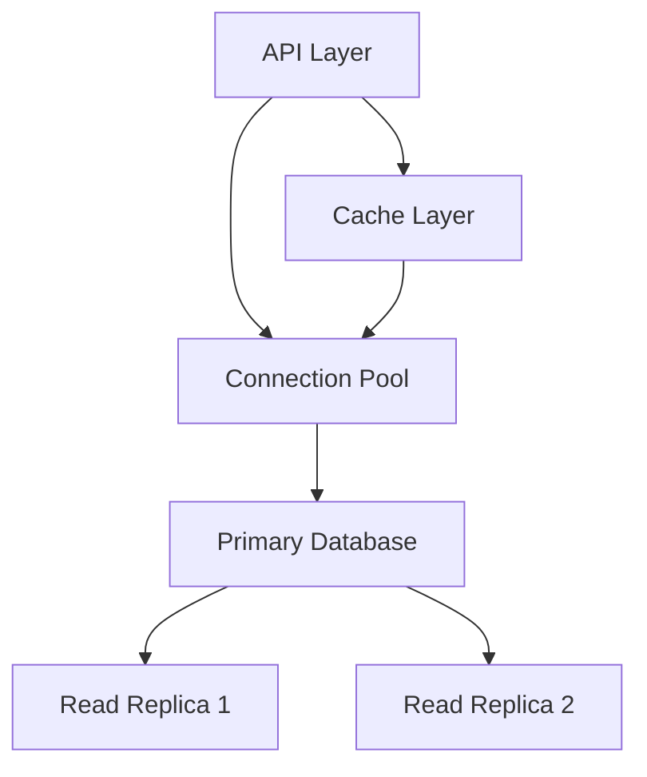
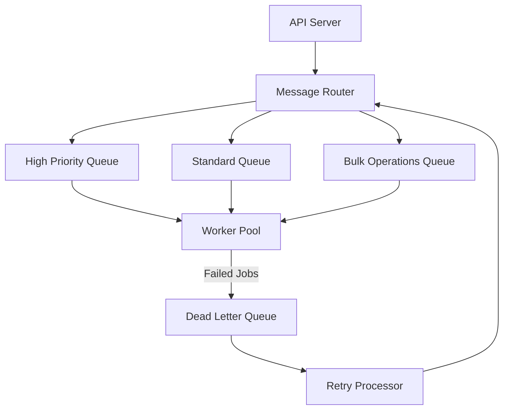

# Scalability Improvements for Movie Booking App

This document outlines a comprehensive strategy for improving the scalability of the Movie Booking App to handle increased traffic, larger datasets, and peak booking scenarios.

## Current Architecture Analysis

The current architecture consists of three main components:

1. **User-App (Next.js frontend)**: Client-facing application for user interactions
2. **Express-Server (API Server)**: Handles booking requests and adds them to Redis queue
3. **Worker Service**: Processes booking requests from the Redis queue sequentially

While this architecture provides a solid foundation, there are several areas that can be enhanced to improve scalability and reliability.

## Scalability Enhancements

### 1. Horizontally Scalable API Layer

#### Current Limitation:
Currently, the Express server operates as a single instance, creating a potential bottleneck during high-traffic periods.

#### Proposed Solution:
- Implement a load-balanced API layer with multiple Express server instances
- Use stateless design patterns to ensure any API instance can handle any request
- Add health checks for auto-recovery and instance replacement

#### Implementation Strategy:
1. Containerize the Express server using Docker
2. Deploy multiple instances behind a load balancer (e.g., Nginx, AWS ALB)
3. Implement connection pooling for Redis to optimize connections from multiple instances

### 2. Enhanced Worker Pool Architecture

#### Current Limitation:
The single worker service processes bookings sequentially, limiting throughput and creating a single point of failure.

#### Proposed Solution:
- Create a worker pool with multiple specialized workers
- Implement a partitioning strategy based on cinema/auditorium IDs
- Use Redis consumer groups to distribute work efficiently

#### Implementation Strategy:
1. Create a worker coordinator service that manages the worker pool
2. Implement Redis consumer groups for distributing work among workers
3. Define partition keys based on cinema/auditorium IDs to ensure consistency
4. Implement worker-specific retry logic and dead-letter queues

### 3. Database Scalability Improvements

#### Current Limitation:
The current database design might face contention during high-volume periods, especially during popular movie releases.

#### Proposed Solution:
- Implement read replicas for handling read-heavy operations
- Add database connection pooling to optimize resource usage
- Apply database sharding strategies for cinema/movie data based on geographical regions
- Implement cache layers for frequently accessed, relatively static data (movie details, cinema information)

#### Implementation Strategy:
1. Configure Prisma to support connection pooling
2. Set up read replicas for PostgreSQL
3. Implement Redis caching for frequently accessed data
4. Create database indexes optimized for common query patterns

### 4. Distributed Caching Strategy

#### Current Limitation:
The application currently lacks a comprehensive caching strategy, resulting in unnecessary database queries.

#### Proposed Solution:
- Implement a multi-level caching strategy using Redis
- Cache movie listings, cinema details, and seat availability information with appropriate TTLs
- Implement cache invalidation strategies to maintain data consistency

#### Implementation Strategy:
1. Create a new shared package for caching services
2. Implement cache abstraction layer with Redis as the backend
3. Add cache-control headers for client-side caching where appropriate
4. Implement intelligent cache warming for predictable high-traffic events (e.g., new movie releases)

### 5. Queue System Enhancements

#### Current Limitation:
The current Redis-based queue lacks advanced features for handling failures, retries, and prioritization.

#### Proposed Solution:
- Enhance the queue system with dead-letter queues, retries, and message TTLs
- Implement priority queues for different types of booking operations
- Add monitoring and alerting for queue health and processing delays

#### Implementation Strategy:
1. Create a more sophisticated queue management system using Redis Streams
2. Implement dead-letter queues for failed booking attempts
3. Add retry mechanisms with exponential backoff
4. Develop monitoring dashboards for queue health

## Scalability Testing Strategy

To validate the effectiveness of these improvements, we recommend implementing:

1. **Load Testing**: Simulate peak traffic scenarios with tools like k6 or JMeter
2. **Chaos Engineering**: Test system resilience by introducing failures in different components
3. **Performance Benchmarking**: Establish baseline metrics and regularly test improvements
4. **Continuous Monitoring**: Implement comprehensive monitoring using Prometheus and Grafana

## Implementation Roadmap

1. **Phase 1 (1-2 weeks)**
   - Implement connection pooling for database and Redis
   - Add basic caching for movie and cinema data
   - Set up monitoring for current bottlenecks

2. **Phase 2 (2-3 weeks)**
   - Containerize API and worker services
   - Implement horizontally scalable API layer with load balancing
   - Enhance queue system with dead-letter queues and retries

3. **Phase 3 (3-4 weeks)**
   - Implement worker pool architecture
   - Set up database read replicas
   - Develop comprehensive caching strategy

4. **Phase 4 (2-3 weeks)**
   - Implement database sharding strategy
   - Optimize for geographic distribution
   - Comprehensive load testing and performance tuning

## Conclusion

These scalability improvements will significantly enhance the Movie Booking App's ability to handle increased load, particularly during peak periods like new movie releases or holiday seasons. By implementing these changes incrementally, we can maintain system stability while gradually increasing capacity and resilience.

The architecture will evolve from a simple three-component system to a robust, distributed system capable of horizontal scaling to meet demand while maintaining data consistency and providing a seamless user experience.