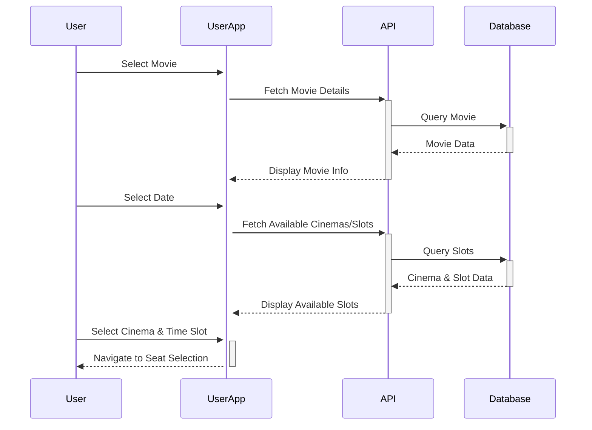

# Movie Booking Workflow Architecture Report

## Executive Summary

This report provides a comprehensive analysis of the movie booking workflow in the application. The system is built as a monorepo using Turborepo, consisting of three main services: a Next.js frontend (`user-app`), an Express.js API server (`express-server`), and a Redis queue worker (`worker`). The architecture implements a robust transaction processing system to ensure seat booking integrity through a distributed queue mechanism.

## System Architecture Overview

```
┌──────────────┐     ┌────────────────┐     ┌──────────────┐     ┌──────────────┐
│              │     │                │     │              │     │              │
│   User App   │────▶│ Express Server │────▶│  Redis Queue │────▶│    Worker    │
│  (Next.js)   │     │  (API Server)  │     │              │     │   Service    │
│              │     │                │     │              │     │              │
└──────────────┘     └────────────────┘     └──────────────┘     └──────┬───────┘
                                                                        │
                                                                        │
                                                                        ▼
                                                              ┌──────────────────┐
                                                              │                  │
                                                              │   PostgreSQL     │
                                                              │   Database       │
                                                              │   (via Prisma)   │
                                                              │                  │
                                                              └──────────────────┘
```

## Core Components

### 1. User-App (Next.js Frontend)

The frontend application provides the user interface for movie browsing, seat selection, and booking. It is built using Next.js with React components.

#### Key Components:

**MovieDetails and Booking Flow:**
- `BookingMovieDetail.tsx`: Displays movie information including name, languages, certificate, and rating.
- `BookingDate.tsx`: Allows users to select dates for movie showings.
- `CinemaList.tsx`: Shows available cinemas and time slots for the selected movie and date.

**Seat Selection:**
- `AuditoriumStructure.tsx`: Renders the auditorium layout with a grid of seats.
- `Seat.tsx`: Individual seat component that displays the seat status (available, booked, or selected).
- `Popup.tsx`: Modal for selecting the number of seats to book.

**Payment Processing:**
- `PayingAmountButton.tsx`: Button component for initiating the payment process.

### 2. Express-Server (API Server)

Acts as an intermediary between the frontend and the Redis queue. It receives booking requests from the frontend and adds them to the Redis queue.

#### Key Functionality:

```typescript
app.post('/', async (req, res) => {
  const bookedSeat = req.body.bookedSeats;
  const userId = req.body.userId;
  const startTime = req.body.startTime;
  const cinemaId = req.body.cinemaId;
  try {
    await client.lPush('bookedSeat', JSON.stringify({bookedSeat, userId, startTime, cinemaId}));
    res.status(200).json({message: 'Booking seat request added to queue'});
  }
  catch(e) {
    console.log('Redis pushing error');
    res.status(500).json({message: 'Error in sending message to queue'});
  }
})
```

### 3. Worker Service (Queue Processor)

Processes booking requests from the Redis queue and handles database transactions. This ensures that seat bookings are processed sequentially, preventing conflicts.

#### Key Functionality:

**Queue Processing:**
```typescript
async function startWorker() {
  try {
    await client.connect();
    console.log("Redis worker Client connected");

    while (true) {
      try {
        const elem = await client.brPop("bookedSeat", 0);
        if (elem?.element) {
          await applyBooking(elem.element);
          console.log("Booking processed:", elem);
        }
      } catch (e) {
        console.log("Error in processing booking:", e);
      }
    }
  } catch (e) {
    console.log("Error in connecting worker:", e);
  }
}
```

**Transaction Processing:**
```typescript
async function startTransaction(
  seats: number[],
  amount: number,
  userId: number,
  startTime: number,
  cinemaId: number
) {
  await prisma.$transaction(async (tx) => {
    // Row-level locking for each seat to prevent conflicts
    for (const seatId of seats) {
      await tx.$queryRaw`SELECT * FROM "Seat" WHERE "id" = ${seatId} FOR UPDATE`;
    }
    
    // Verify seats are available
    const seatStatuses = await tx.seat.findMany({
      where: { id: { in: seats } },
      select: { id: true, booked: true },
    });

    const unavailableSeats = seatStatuses.filter(seat => seat.booked);
    if (unavailableSeats.length > 0) {
      throw new Error(`Seats ${unavailableSeats.map(seat => seat.id).join(', ')} are already booked`);
    }

    // Process payment
    // [Additional transaction code...]
  });
}
```

## Database Schema

The application uses PostgreSQL with Prisma ORM. The key entities in the booking workflow include:

- **User**: Stores user information and account balance for payments
- **Movie**: Contains movie details including available dates
- **Cinema**: Represents movie theaters with auditoriums
- **Audi**: Represents individual auditoriums with seat layouts
- **Seat**: Individual seats that can be booked
- **Booking**: Records of completed bookings
- **Slots**: Available time slots for movies at specific auditoriums
- **Bank**: System bank that handles movie booking payments

## Booking Workflow Sequence

### 1. Movie Selection & Slot Booking



### 2. Seat Selection & Payment

```
┌─────┐     ┌────────────┐      ┌───────────┐     ┌────────────┐
│User │     │Frontend    │      │Express    │     │Redis       │
│     │     │(Next.js)   │      │Server     │     │Queue       │
└──┬──┘     └─────┬──────┘      └─────┬─────┘     └──────┬─────┘
   │              │                   │                  │
   │ Select Seats │                   │                  │
   │─────────────>│                   │                  │
   │              │                   │                  │
   │ Click Pay    │                   │                  │
   │─────────────>│                   │                  │
   │              │ POST booking data │                  │
   │              │──────────────────>│                  │
   │              │                   │ LPUSH booking    │
   │              │                   │─────────────────>│
   │              │                   │                  │
   │              │ 200 OK            │                  │
   │              │<──────────────────│                  │
   │              │                   │                  │
   │ Show Payment │                   │                  │
   │ Processing   │                   │                  │
   │<─────────────│                   │                  │
   │              │                   │                  │
   │              │                   │                  │
```

### 3. Transaction Processing by Worker

```
┌──────────┐     ┌───────────┐     ┌────────────┐
│Redis     │     │Worker     │     │Database    │
│Queue     │     │Service    │     │(PostgreSQL)│
└─────┬────┘     └─────┬─────┘     └──────┬─────┘
      │                │                  │
      │ BRPOP booking  │                  │
      │<───────────────│                  │
      │                │                  │
      │ Booking data   │                  │
      │───────────────>│                  │
      │                │ BEGIN TRANSACTION│
      │                │─────────────────>│
      │                │                  │
      │                │ Lock seats       │
      │                │─────────────────>│
      │                │                  │
      │                │ Check availability│
      │                │─────────────────>│
      │                │                  │
      │                │ Process payment  │
      │                │─────────────────>│
      │                │                  │
      │                │ Update seats     │
      │                │─────────────────>│
      │                │                  │
      │                │ Create booking   │
      │                │─────────────────>│
      │                │                  │
      │                │ COMMIT           │
      │                │─────────────────>│
      │                │                  │
```

## Seat Selection Algorithm

The seat selection algorithm is implemented in `selectTheSeats.ts`. It works as follows:

1. Start from the user-selected seat
2. Add adjacent seats until the requested number is reached
3. Skip already booked seats
4. Wrap to the next row if needed

```typescript
export default function selectTheSeats(
  audi: AudiType | undefined,
  selectedSeat: SeatType | undefined,
  numberOfSeats: number
): number[] {
  // Return empty array if we don't have auditorium data or a selected seat
  if (!audi || !selectedSeat) return [];
  else {
    // Get seats array and sort by ID for consistent ordering
    const seats = [...audi.seats];
    seats.sort((a: SeatType, b: SeatType) => a.id - b.id);
    const rows = audi.rows;
    const cols = audi.cols;
    let c = selectedSeat.col; // Starting column
    const bookedSeats: number[] = []; // Array to hold selected seat IDs
    let noOfSeats = 0; // Counter for number of seats selected
    let r = selectedSeat.row; // Starting row
    
    // Iterate through rows and columns starting from the selected seat
    for (let i = 0; i < rows; i++) {
      for (let j = 0; j < cols; j++) {
        // Calculate next row and column with wrap-around
        let nr = r + i;
        let nc = c + j;
        nr = ((nr - 1) % rows) + 1; // Ensure row wraps around (1 to rows)
        nc = ((nc - 1) % cols) + 1; // Ensure column wraps around (1 to cols)
        
        // Calculate seat index in the flat array
        const seatIndex = (nr - 1) * cols + nc - 1;
        
        // Add seat if it's not already booked
        if (seatIndex < seats.length && !seats[seatIndex].booked) {
          bookedSeats.push(seats[seatIndex].id);
          noOfSeats++;
          
          // Return as soon as we have enough seats
          if (noOfSeats === numberOfSeats) return bookedSeats;
        }
        
        // Move to next row when we reach the end of a column
        if (nc === cols) r++;
      }
    }
    
    // Return whatever seats we found
    return bookedSeats;
  }
}
```

## Critical ACID Compliance Mechanisms

The system ensures ACID (Atomicity, Consistency, Isolation, Durability) compliance through:

### 1. Row-Level Locking

```typescript
// Worker locks each seat to prevent concurrent booking
for (const seatId of seats) {
  await tx.$queryRaw`SELECT * FROM "Seat" WHERE "id" = ${seatId} FOR UPDATE`;
}
```

### 2. Transaction Integrity

```typescript
// All operations are performed within a single transaction
await prisma.$transaction(async (tx) => {
  // Seat locking
  // Seat availability check
  // Payment processing
  // Seat status updates
});
```

### 3. Sequential Processing via Redis Queue

```typescript
// Express server adds bookings to queue
await client.lPush('bookedSeat', JSON.stringify({bookedSeat, userId, startTime, cinemaId}));

// Worker processes one booking at a time
const elem = await client.brPop("bookedSeat", 0);
```

## API Interfaces

### 1. Movie and Cinema Slot Selection API

```typescript
// POST /api/booking
export async function POST(req: Request) {
  const body = await req.json();
  const movieId = body.movieId;
  const currDate: string = body.currDate;
  
  // Fetch available slots for the movie on the given date
  // [Implementation details...]
  
  return NextResponse.json({ cinema: result });
}
```

### 2. Auditorium and Seat Data API

```typescript
// POST /api/booking/slots
export async function POST(req: Request) {
  const body = await req.json();
  const cinemaId = body.cinemaId;
  const timeStamp = body.timeStamp;
  
  // Fetch auditorium data including seats
  // [Implementation details...]
  
  return NextResponse.json({audi: audi[0]});
}
```

### 3. Booking Request API (Express Server)

```typescript
app.post('/', async (req, res) => {
  const bookedSeat = req.body.bookedSeats;
  const userId = req.body.userId;
  const startTime = req.body.startTime;
  const cinemaId = req.body.cinemaId;
  
  // Add booking to Redis queue
  // [Implementation details...]
  
  res.status(200).json({message: 'Booking seat request added to queue'});
})
```

## State Management

The application uses a combination of React state hooks and Recoil for state management. Key state elements include:

1. **Movie Selection State:**
   - Movie details, cinema options, and available dates

2. **Seat Selection State:**
   - Auditorium layout, seat availability, and user selections

3. **Payment Processing State:**
   - Selected seats, total amount, and booking status

## Performance and Scalability Considerations

1. **Queue-Based Architecture:**
   - Separating the booking request (user-app → express-server) from the processing (worker) allows for better scalability and fault tolerance.

2. **Database Optimization:**
   - Row-level locking is used instead of table locks to maximize concurrency.
   - Transactions ensure data integrity without sacrificing performance.

3. **Stateless Design:**
   - The Express server is stateless, making horizontal scaling possible.
   - Redis provides a distributed queue that can be scaled independently.

## Security Measures

1. **Authentication:**
   - NextAuth is used for user authentication.
   - User sessions are verified before processing booking requests.

2. **Data Validation:**
   - Input validation is performed at multiple levels:
     - Client-side validation in the frontend
     - Server-side validation in the Express server
     - Transaction validation in the worker

3. **Payment Security:**
   - Payment processing is handled within database transactions to prevent partial operations.
   - User balance is checked before processing the payment.

## Error Handling

1. **Frontend Error Handling:**
   - Loading states are managed to provide feedback during API calls.
   - Error states are displayed when requests fail.

2. **Queue System Error Handling:**
   - Failed bookings do not affect the processing of other bookings.
   - The worker service logs errors and continues processing the queue.

3. **Transaction Error Handling:**
   - Database transactions are rolled back if any part fails.
   - Detailed error messages help identify the cause of failures.

## Conclusion

The movie booking workflow is implemented with a robust architecture that ensures data integrity, prevents booking conflicts, and provides a smooth user experience. The separation of concerns between frontend, API server, and worker service allows for maintainability and scalability.

Key strengths of this architecture include:
- ACID-compliant seat booking transactions
- Queue-based processing to prevent conflicts
- Clear separation of concerns between services
- Efficient seat selection algorithm
- Scalable and maintainable codebase

This architecture successfully addresses the challenges of managing concurrent seat bookings in a movie theater application, ensuring that users can confidently select and purchase seats without worrying about conflicts or double bookings.